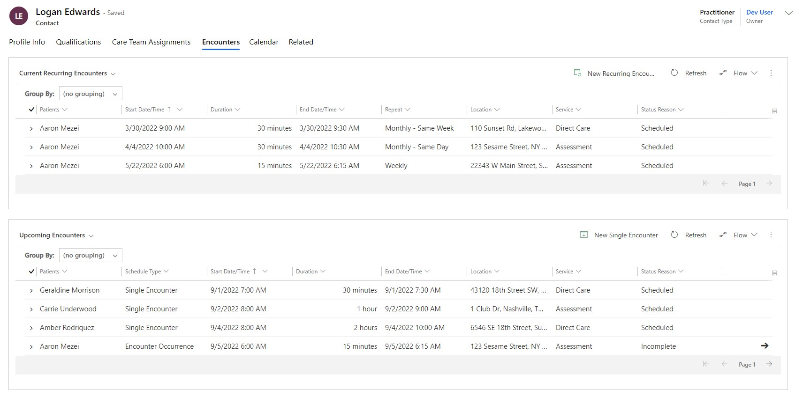

# Overview

The Encounters tab has 2 sub grid. 1 sub grid lists all the recurring encounters related to this Practitioner and the other sub grid lists all the single or occurring encounters related to this Practitioner.

 

# Encounters 

The sub grids display the Patients, Start Date/Time, Duration, End Date/Time, Repeat, Location, Service and Status Reason.

 ### <u> Add New Encounter </u>
 
 To create a new Encounter, click on the New Recurring Encounter or New Single Encounter button on the sub grid. This will open up the New Encounter Main Form.

 To read more about Encounters, [click here.](../AutismCare/SingleEncounters.md)
