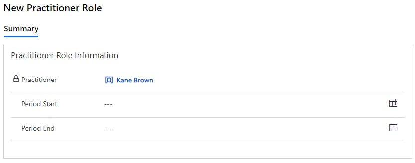
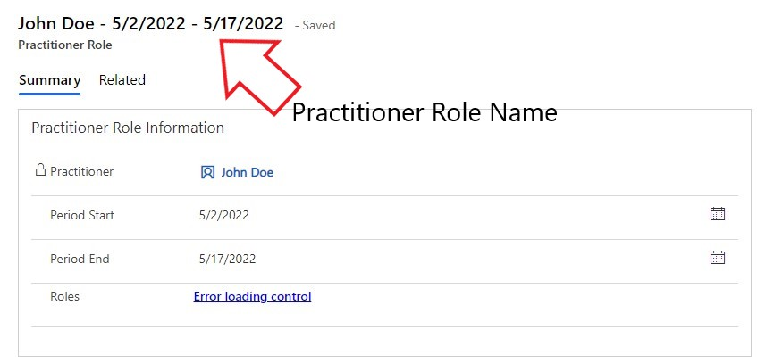

# Overview

The Practitioner Role Main Form is divided into 2 sections. The first section is the the Practitioner Role Information section. This contains a Practitioner and a date range. The second section is the Practitioner Roles. This section contains a sub grid which lists the Role(s) assigned to the Practitioner in the defined date range.  

The Practitioner Role form must be saved to add Practitioner Roles in the Practitioner Roles sub grid. 

 

# Summary

## Practitioner Role Information

- Practitioner 
  - If this form is opened via the Practitioner Role sub grid (on the Practitioner Main Form), this field is populated with the 'Practitioner' and is locked.  
    
  - This field is filtered to display Practitioners. 
- Period Start
- Period End

 

## Practitioner Roles

The 'Practitioner Roles' section displays the Role (Code) and the Practitioner Role (Practitioner & Dates). 

 ### <u> Add New Practitioner Role Code </u>
 
 To create a new Practitioner Role Code, click on the 3 dots on the sub grid. Then click on the 'New Practitioner Role Code' button. This will open up the New Practitioner Role Code Main Form.

 

> ### Practitioner Role Code
> 
> ### General
> The 'General' section contains the Code for a Role and a Practitioner Role.
>
> - Code 
>   - The lookup field displayed is filtered to ensure only relevant records display. 
> - Practitioner Role - If this form is opened via the Practitioner Roles sub grid (on the Practitioner Role Main Form), this field is populated with the 'Practitioner Role'.
>

 

Practitioner Role Name - The Practitioner Role Name is populated as the Practitioner Name and the Practitioner Role Codes separated by a '-'. If there is more then 1 Practitioner Role Code, they are separated by a ','. See below. 

