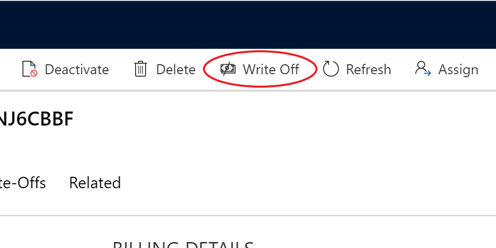

# **Claim Overview**
This section contains an overview of how users interact with claims, as well as how they're brought into the system.

## **Viewing a Claim**
Upon import of an 835 Remit file, the system constructs a claim based on the information in the remit. (See [Reversals](...reversals) for a detailed explanation on how reversals are handled by the system.)

### **Claim Main Grid**

Navigate to the Claims main grid by clicking 'Claims' on the sitemap. To search for and navigate to claims, use the claims main grid.

By default, the 'Current Claims' view will display. Other available views are - Historical Claims and All Claims.

- Current Claims - Claims with a status reason of 'Current Submission'. 
- Historical Claims - Claims with a status reason of 'Historical Submission.
- All Claims - Lists all claims; with a status reason of 'Current Submission' and 'Historical Submission'.

To open a claim form, click on a claim record in the grid.

The claim main form displays all claim details as they were submitted to and returned by the pay0r on the remit. For efficient research and follow-up, claim related information such as previous submissions of the claim, all remits against the claim, write-offs recorded on the claim, and the case that has been created to resolve payment discrepancies for the claim, are displayed as well.

### **Claim Info**
The Claim Info tab is where the claim information is displayed in its entirety. This tab is divided into two main sections -

The top half displays the the general claim details, as they were submitted to the payor. 

| Field | Description |
|---|---|---| --- |
|Status Reason |The claim's status - whether it is the 'Current Submission' or a 'Historical Submission' of the claim. (See [Submissions Summary](/SubmissionSummary) below.)
|Claim Number |The claim number your organization assigned to the claim. (Patient Account Number)
|Claim Type	|The category of claim e.g. professional, institutional, oral, pharmacy, vision.
|Period Start |The Service Start Date of the earliest claim line.
|Period End |The Service End Date of the latest claim line.
|Total Billed |	The amount billed in this claim. This is the sum of the billed amount for each service line in the claim.
|Expected Price List |A lookup to the [Price List](/Remits/Setup/Price-List) detailing the allowed (expected) price per service, based on your organization's contracted rates with the payor. 
|Payor | A lookup to the the insurer who has adjudicated this claim.
|Provider |A lookup to the the individual or agency that provided the services in this claim.
|Patient |A lookup to the patient to whom the services in this claim were rendered.
|Coverage |A lookup to the patient's insurance policy applicable in this claim's reimbursement.
|Total Paid - Claim Submission | The amount paid for this claim submission. This is the sum of the paid amount for each service line in the claim.
|Total Paid - All Submissions | The amount paid in all claim submissions of this claim. This is the sum of the 'Total Paid - Claim Submission' field in all claim submissions of this claim.
|Total Expected |The amount your organization expects to receive in payment for this claim. This is the sum of the expected amount for each service line in the claim. The expected amount is based on the 'Expected Price List' selected on the claim.
|Total Paid | The total amount received in payment for this claim since the first submission and including all subsequent submissions. This is the same as the 'Total Paid - All Submissions' field.
|Total Cost Share Adjustments | The amount the 'Outstanding Amount' on the claim is reduced by [Cost Share Adjustments](/Remits/Remit/Adjustments/Cost-Share-Adjustments) - based on the CARC Codes the organization set to include as Cost Share Adjustments. This is the sum of the Cost Share Adjustment amount for each service line in the claim, and any remit level adjustments on the claim.
|Total Write-Offs | The amount the 'Outstanding Amount' on the claim is reduced by [Write Offs](/Remits/Claim/Write-Offs) recorded on the claim as a whole, and individual claim lines.
|Total Outstanding | The unpaid amount that your organization is expecting to receive for this claim. This is the sum of the outstanding amount for each service line in the claim. The 'Total Outstanding' amount is auto-calculated by the system as: *Total Expected - Total Paid - Total Cost Share Adjustments - Total Write-Offs = Total Outstanding*.

   

The second half of the screen is a grid listing the details for all claim lines in this claim. 

To view the write-offs recorded on a claim line, click on the '>' next to a claim line to expand the grid.

### **Submissions Summary**
On the submissions Summary tab you can see the complete history of the claim - how many times the claim was resubmitted, and what changed in each submission.
The status reason on the claim differentiates between the most recent submission - in which the status reason is 'Current Submission', and all previous sumbissions - marked with the status reason 'Historical Submission'.

To view details on a claim submission, click on the '>' next to a claim submission record to expand the grid, and view the claim lines in this claim submission.

#### **Claim Status Reason - Current Submission vs. Historical Submission**

A newly created claim has a status reason 'Current Submission'. If the claim is resubmitted to the payor for reconsideration, and a new remit - against the same claim, with the same claim number - enters the system, the status reason on the first claim is updated to 'Historical Submission' and the new claim assumes the 'Current Submission' status reason.

The 'Current Submission' of each claim always contains the most up-to-date information about the claim, which is reflected in the calculations. When viewing a 'Historical Submission' of a claim, a warning banner will display on top of the form notifying you that there is a more recent and updated version of the claim, with a link to the 'Current Submission' of the claim.

### **Remits Summary**
The Remits Summary sub-grid shows all remits that have been received from the payor as a response to this claim. You can use the two system views to select whether all remits received against all submissions of the claim are displayed, or only those received against this submission of the claim.

To see the service lines included in a remit, click on the '>' next to a record to expand the grid, and view service line details and adjustments.

A single claim submission can have multiple remits against it.  For example, in the case of a payment reversal: The original payment is one remit, and the subsequent reversal is the second remit. Both of these remits are received against a single claim submission. Or, if the payor split the claim you submitted and paid it in more than  one remit.

When there is a combination of both of the above scenarios, there could be quite a few remits against the same claim submission.

### **Write-Offs**
Here, all write-offs that were created on the claim level, and service line level are listed in the two sub-grids on this tab.

#### **Claim Level Write-Offs**
A claim level write-off is a write-off applied on the claim.

To create a claim level write-off, click the Write-Off button on the command bar. A quick create form will slide out on the side of the screen where you can enter the write-off details. Click 'Save and Close' to save the write-off record you just created, and return to the claim form.

 

| Field | Description |
|---|---|---| --- |
|Claim |The claim against which this write-off is being recorded. This field is auto-populated with the claim name of the claim you are recording the write-off on.
|Amount | Enter the write-off amount.
|Reason |Select the reason for the write-off from the following options: Exceeded authorization, Billed duplicates, System billing error, Timely filing, Uncredentialed provider, Rate adjustment, Non-billable service.

#### **Claim Line Level Write-Offs**
A claim line level write-off is a write-off applied on an individual claim line.

To create a claim line write-off, select the claim line in the Claim Line Sub-grid, and click the Write-Off button in the grid command bar. A quick create form will slide out on the side of the screen where you can enter the write-off details. Click 'Save and Close' to save the write-off record you just created, and return to the claim form.

 

| Field | Description |
|---|---|---| --- |
|Claim Line |The claim line against which this write-off is being recorded. This field is auto-populated with the claim line name of the claim line you are recording the write-off on.
|Amount | Enter the write-off amount.
|Reason |Select the reason for the write-off from the following options: Exceeded authorization, Billed duplicates, System billing error, Timely filing, Uncredentialed provider, Rate adjustment, Non-billable service.

### **Case Info**

